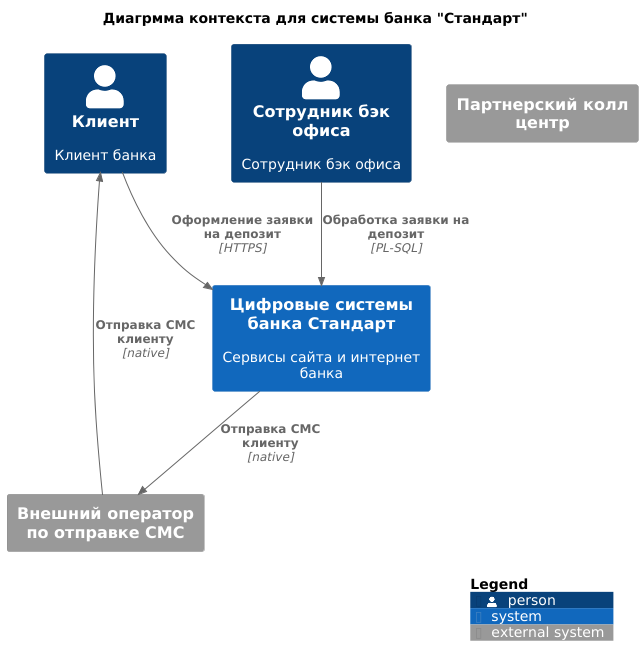
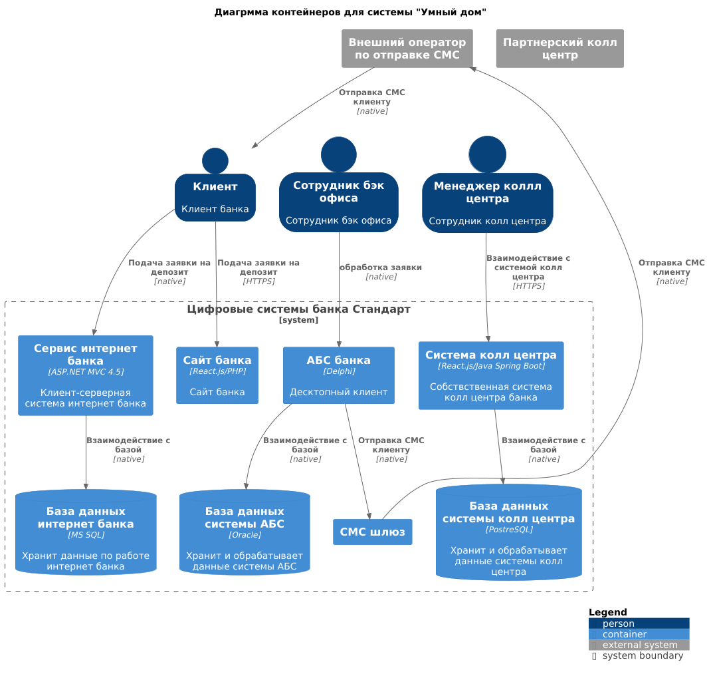

### **Название задачи:** 
### **Автор:** Nazir Bavizhev
### **Дата:** 01.01.1970
### **Функциональные требования**
Опишите здесь верхнеуровневые Use Cases. Их нужно оформить в виде таблицы с пошаговым описанием:

|**№**|**Действующие лица или системы**|**Use Case**|**Описание**|
| :-: | :- | :- | :- |
|UC1|клиент, сайт|просмотр списка депозитов|1. Клиент заходит на сайт   2. В разделе с депозитами клиент видит список депозитов с актуальными ставками   3. Можно делать поиск,фильтрацию по депозитам|
|UC2|сайт, клиент, менеджер, сотрудник бэк офиса, АБС|подача заявки на депозит через сайт|1. Клиент заходит на сайт   2. Клиент выбирает депозит и в специальной форме отставляет заявку на депозит указав номер телефона   4. Менеджер звонит клиенту и обговаривает условия   5. Если клиент согласился на условия то сотрудник бэк офиса обрабатывает заявку в АБС|
|UC3|клиент, интернет-банк|просмотр списка депозитов|1. Клиент заходит(аутентифицируется и авторизуется)  в интернет банк   2. В разделе с депозитами клиент видит список депозитов с персонализированными ставками   3. Можно делать поиск,фильтрацию по депозитам|
|UC3|интернет банк, клиент, сотрудник бэк офиса|подача заявки на депозит через интернет-банк|1. Клиент заходит в интернет-банк   2. Клиент видит список актуальных депозитов с персонализированными ставками   3. Клиент в специальной форме указывает счет, сумму депозита и подает заявку на орткрытие депозита   4. Клиенту приходит код для подтверждения по СМС   Клиент в специальной форме вводит код и подтверждает операцию   5. После подтверждения операции сотрудник бэк офиса обрабатывает заявку через АБС|
### **Нефункциональные требования**
Опишите здесь нефункциональные требования и архитектурно-значимые требования.

|**№**|**Требование**|
| :-: | :- |
|R1|Все сервисы должны работать 24/7|
|R2|Доступность всех систем должна быть 99.9|
|R3|В случае сбоев в ЦОД необходимо, чтобы сервисы интернет-банка были доступны и выдерживали требуемую нагрузку|
|P1|Отклик по всем операциям должен занимать ~миллисекунды|
|P2|Сервера должны уметь горизонтально масштабироваться|
|+R1|Нужно как можно больше использовать технологии, которые уже есть в банке       |
|+R2|Можно развернуть новые технологии, но необходимо, чтобы они были совместимы с существующими платформами разработки|
|+R3|Желательно чтобы по новым технологиям существовала экспертиза внутри банка|
|+R4|При проведении платежей некоторые справочные данные загружаются больше секунды|
|+R5|Лучше избежать прямой работы интернет-банка с API АБС в новом процессе|
|+R6|Доработки по СМС нужно вести силами команды разработки банка|
|+R7|АБС можно масштабировать только вертикально     
|+R8|Если будет принято решение использовать брокер, то лучше испорльзовать Kafka|

### **Решение**

1. Требование +R1. В банке в целом используется современный чтек технологий который можно переиспользовать в случае необходимости. Особенно в плане баз данных
2. Требование +R2. Так как сервисы должны уметь горизонтально масштабироваться то нужно будет уметь балансировать траффик между ними. Для этолго этого скорее всего нужно будет внедрить API gateway который сочетал бы в себе много различного функционала.
3. Требование +R4. Так как справочные данные загружаются больше секунды, т.е стоит расмотреть вариант оптимизации процессов по выдаче данных, может быть внедрить индексы в базу или поставить кэш.
4. Требование +R5. Чтобы избежать прямой работы сервиса интернет банка с АБС нужно перевести взаиможействие на асинхронный режим. Для этого нужно внедрить брокер сообщений. Рекомендуется Kafka. Но она не совместима с версией интенрт банка поэтому следует или обновить версию интернет банка, если новая версия поддерживает это. Либо доработать своими силами IT отдела банка. 
5. Требование +R7. Так как АБС может масштабироваться только вертикально то стоит подумать над возможностью репликации и шардирования базы 

### **Альтернативы**

1. Использовать более легковесный брокер сообщений который гарантирует сохранность данных например nats streaming
2. Использовать один вид реляционных баз. Так как в инфрастурктуре используется три разных реляционных базы и если используемые технологии позволяют работать с разными базами то имеет смысл расмотреть возможность оставить только одну базу

Опишите здесь наиболее важные альтернативные решения.

**Недостатки, ограничения, риски**

1. Вероятно большая нагрузка на IT отдел
2. По мере роста нагрузки узкирм местом может стать систма АБС
3. Даже на этапе MVP если количество заявок будет болльшим есть риск что сотрудники бэк офиса не буджет успевать обрабатывать заявки

