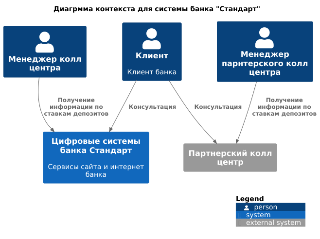
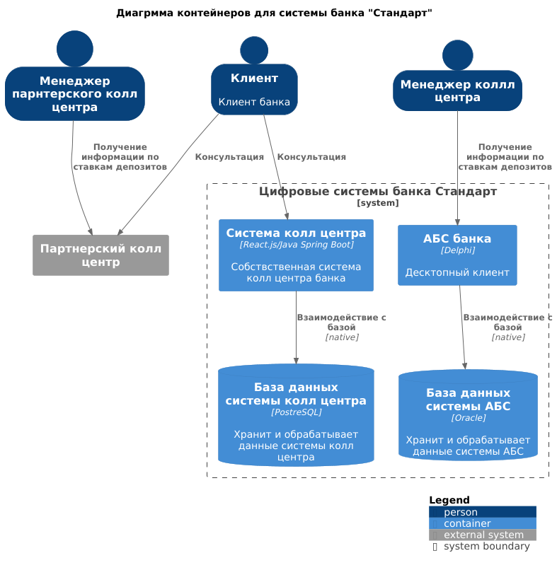

### **Название задачи:** 
### **Автор:**
### **Дата:**
### **Функциональные требования**
Опишите здесь верхнеуровневые Use Cases. Их нужно оформить в виде таблицы с пошаговым описанием:

|**№**|**Действующие лица или системы**|**Use Case**|**Описание**|
| :-: | :- | :- | :- |
|UC1|менеждер колл центра, клиент, АБС|консультация клиента через колл центр|1. Клиент звонит в колл центр для консультаций   2. Менеджер колл центра через систему АБС узнает ставки по депозитам   3. Менеджер сообщает клиенту нужную информацию|
|UC2|менеждер партнерского колл центра, клиент, АБС|консультация клиента через колл центр|1. Клиент звонит в партнерский колл центр для консультаций   2. Менеджер колл центра смотрит ставки по депозитам в специальных файлах   3. Менеджер сообщает клиенту нужную информацию|
### **Нефункциональные требования**
Опишите здесь нефункциональные требования и архитектурно-значимые требования.

|**№**|**Требование**|
| :-: | :- |
|R1|система АБС должна выдерживать нагрузку|
|+R1|Файлы со ставками должны передаваться в партнерский колл центр защищенным образом|
### **Решение**

1. Требование +R1. Систмеа АБС дожна выдерживать возросшую нагрузку. Для этого надо подумать над оптимизацие йработы с базой может быть добавить индексы. Также имеет смысл подумать над репликой на чтение.
2. Требование +R1. Так как ставки по депозитам долны передаваться в партерский кол центр в виде файлов то файлы надо шифровать. Ключи должны быть только у отвественных лиц на обоих сторонах

### **Альтернативы**

 Ставки по депозитам дублировать с базе системы колл центра, это снимет нагрузку на АБС. Но для этого нужно продумывать систему репликациии и усложняет систему. И на данный момент непонятно понадобится ли это

**Недостатки, ограничения, риски**

Неудобный механизм передачи ставок в партерский кол центр. В будущем имеет смысл подумать над автоматизаций этого процесса если количество обращений в кол центр не снизится.

Подробно опишите здесь недостатки, ограничения и риски выбранного решения.

